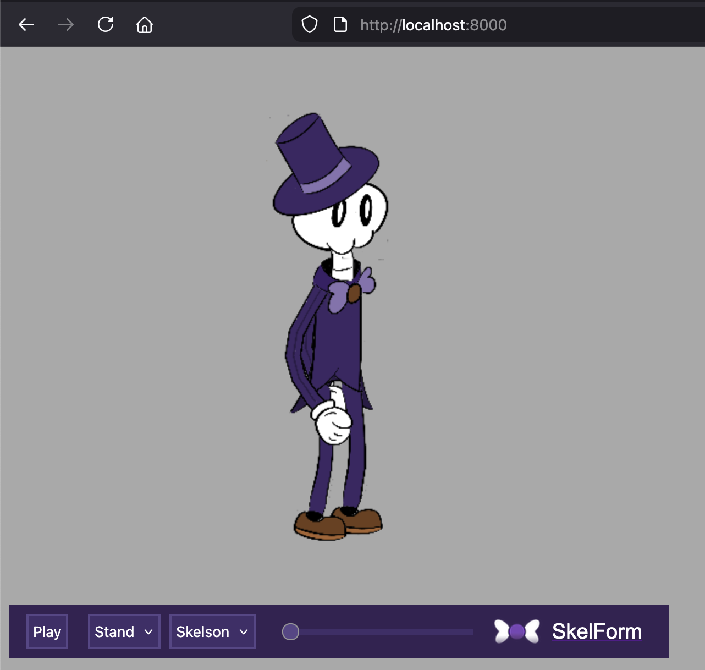

# SkelForm Web Player

WebGL-powered player for SkelForm animations on the web.

## Features

Includes all SkelForm runtime features, as well as an optional player with:

- Animation progress bar
- Switching animations
- Switching styles

## Example

```html
<script>
  async function start() {
    // Download and initialize .skf file and its armature.
    // Note: both functions below are async
    let skellington = await SkfDownloadSample("skellington.skf");
    await SkfInit(skellington, glcanvas);

    // Initialized armatures go into an 'skfCanvases' array.
    // All configurable settings are shown below, assuming the first canvas.
    // Everything else in each skfCanvas is automatically configured and should not be tampered with.
    skfCanvases[0].activeStyles = [skfCanvases[0].armature.styles[1]];
    skfCanvases[0].selectedAnim = 1;
    skfCanvases[0].smoothFrames = 0;
    skfCanvases[0].playing = true;
    skfCanvases[0].constructOptions.scale = { x: 0.125, y: 0.125 };
    skfCanvases[0].constructOptions.position = { x: 300, y: -250 };

    // Show web player. This is optional, and is only for showcases.
    SkfShowPlayer("player", skfCanvases[0]);

    // Start animating!
    requestAnimationFrame(SkfNewFrame);
  }
  start();
</script>

<div id="player" style="width: 600px; height: 600px">
  <canvas id="glcanvas" width="600" height="500"></canvas>
</div>
```

The above example will load the skellington sample included in the repo:



This repo may be cloned to run the included `index.html` file.

# Hosted files

This library's files are hosted on [skelform.org](https://skelform.org):

```
<script src="https://skelform.org/jszip.js"></script>
<script src="https://skelform.org/runtime.js"></script>
<script src="https://skelform.org/api.js"></script>
```

Sample files:

- https://skelform.org/editor/_skellington.skf
- https://skelform.org/editor/_skellina.skf
