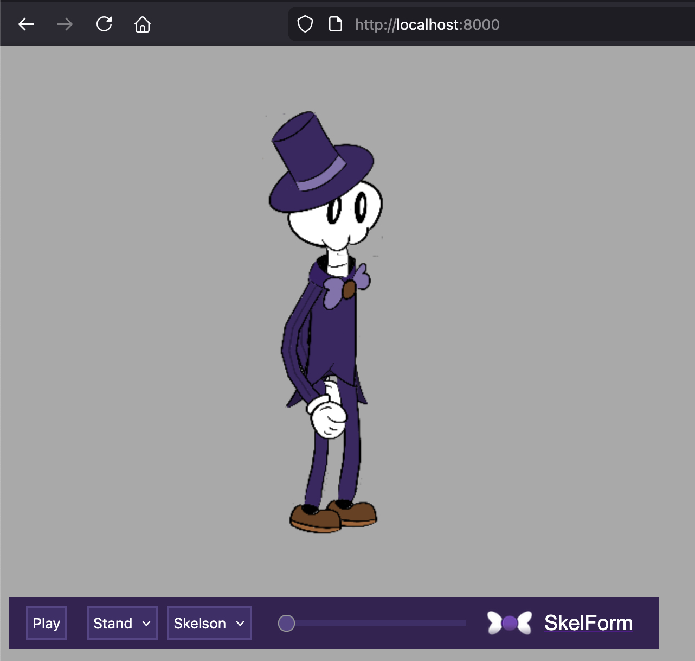

# SkelForm Web Player

WebGL-powered player for SkelForm animations on the web.

## Features

- Animation progress bar
- Switching animations
- Switching styles

Note: this is the player frontend, and requires the
[skelform-js](https://github.com/Retropaint/skelform-js) generic runtime.

## Example

```html
<!-- fetch from https://github.com/Retropaint/skelform-js -->
<script src="skelform-js.js"></script>
<script src="jszip.js"></script>
<script src="api.js"></script>

<script>
    async function start() {
        // Download and initialize .skf file and its armature.
        // Note: both functions below are async
        let skellington = await SkfDownloadSample("skellington.skf");
        await SkfInit(skellington, glcanvas);

        // more armatures can continue being loaded
        let skellina = await SkfDownloadSample("skellina.skf");
        await SkfInit(skellina, glcanvas2);

        // Initialized armatures go into an 'skfCanvases' array.
        // All configurable settings are shown below, assuming the first canvas.
        // Everything else in each skfCanvas is automatically configured and should not be tampered with.
        skfCanvases[0].activeStyles = [skfCanvases[0].armature.styles[3]];
        skfCanvases[0].selectedAnim = 1;
        skfCanvases[0].smoothFrames = 0;
        skfCanvases[0].playing = true;
        skfCanvases[0].constructOptions.scale = { x: 0.125, y: 0.125 };
        skfCanvases[0].constructOptions.position = { x: 300, y: -250 };

        // configs for 2nd armature
        skfCanvases[1].activeStyles = [skfCanvases[1].armature.styles[2]];
        skfCanvases[1].selectedAnim = 1;
        skfCanvases[1].smoothFrames = 0;
        skfCanvases[1].playing = true;
        skfCanvases[1].constructOptions.scale = { x: 0.125, y: 0.125 };
        skfCanvases[1].constructOptions.position = { x: 300, y: -250 };

        // Show web player. This is optional, and is only for showcases.
        // Parameters:
        // - Canvas container ID
        // - skfCanvas (use skfCanvases array)
        // - Show SkelForm branding? (default false)
        SkfShowPlayer("player", skfCanvases[0], false);
        // 2nd armature web player
        SkfShowPlayer("player2", skfCanvases[1], false);

        // Start animating all armatures!
        // This must be called only once
        requestAnimationFrame(SkfNewFrame);
    }
    start();
</script>

<!-- 1st armature web player -->
<div id="player" style="width: 600px; height: 600px">
    <canvas id="glcanvas" width="600" height="500"></canvas>
</div>

<!-- 2nd armature web player -->
<div id="player2" style="width: 600px; height: 600px">
    <canvas id="glcanvas2" width="600" height="500"></canvas>
</div>
```

The above example will load the skellington sample included in the repo:



This repo may be cloned to run the included `index.html` file.

# Hosted files

This library's files are hosted on [skelform.org](https://skelform.org):

```html
<script src="https://skelform.org/jszip.js"></script>
<script src="https://skelform.org/skelform-js.js"></script>
<script src="https://skelform.org/api.js"></script>
```

Sample files:

- https://skelform.org/editor/_skellington.skf
- https://skelform.org/editor/_skellina.skf
